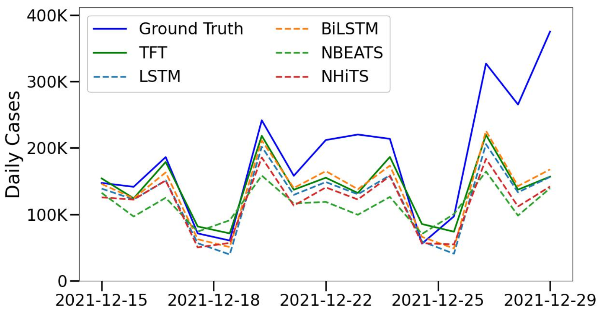

# Experiments

After introducing our principal TFT model, we describe our experiments desing in this chapter. 

## Data Splits

<!--  -->

Unless otherwise mentioned, we use the Primary Split to conudct experiments. Validation set comprises the next 15 days after the training period, and the test set comprises the following 15 days after the validation set. 

## Hyperparameter Tuning
We fine-tune in total 5 models: our proposed TFT model, LSTM, Bi-LSTM, NBEATS, and NHiTS, with last four being the models used for comparison with our TFT model. 
We use the PyTorch implementation for our TFT model and tune the hyperparameters with Optuna with 25 trial runs for each model and selected the best configuration based on the validation loss. All models are optimized using Adam Optimizer and MSE Loss. We make our comparisons by using the best configuration of each models. 

## Evaluation Metrics and Comparison 
We use a variety of metrics including MAE, RMSE, RMSLE, SMAPE, and NNSE because each of them has their own focus. So we use a variety of metrics to hollistically evaluate our model performance. 

| Metric | Usage | Lower is Better 
|---------|--------|----------|
| MAE| penalize the model irrespective of error magnitude| Yes
| RMSE| penalize more for larger outliers | Yes
| SMAPE| measure the proportional error | Yes
| RMSLE| useful when the error distribution is skewed because applying logarithm| Yes
| NNSE|  robust to error variance and has a range of [0,1] | No

Our TFT model excels all other models in terms of all 5 evaluation metrics. 

| Model | MAE | RMSE | RMSLE | SMAPE | NNSE
|---------|--------|----------| ----------| ----------| ----------|
| TFT | **35.68**| **221.3** | **1.347**|**0.842**| **0.679**|
| LSTM | 40.27|267.1|1.434|1.054|0.616|
| Bi-LSTM | 40.36| 261.8| 1.465| 1.022| 0.626|
| NHiTS | 36.79| 247.5| 1.366| 1.066| 0.628|
| NBEATS| 41.22| 244.8| 1.649| 1.134| 0.633|

Our line graph comparing prediction performances also reinforces our conclusions from the evaluation metrics.

<!--  -->

